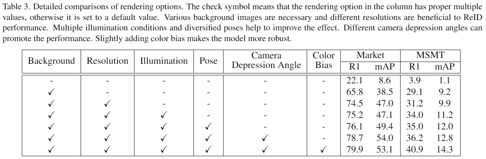
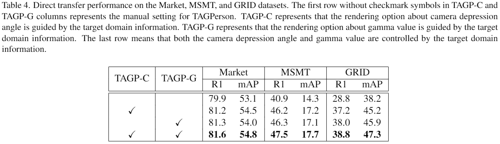

# TAGPerson-ReID
This repository contains the training codes of the paper `TAGPerson: A Target-Aware Generation pipeline for Person Re-identification`.

We use [PyTorch](https://pytorch.org/) to train the person ReID models.

## 0. Experimental Results

**Parts of the experimental results in the paper is listed below.**





The corresponding configs, datasets, and models can be downloaded from [this link](https://drive.google.com/drive/folders/1eiFvsk78OqxerKSceRkORTlk5B7EB3ao).


## 1. Get Started

#### 1.1 Install Python Environment

Create the conda env:
```
conda create -n tagperson-reid python=3.8
conda activate tagperson-reid
```

Install the PyTorch, we use `torch-1.7.1`, `torchvision-0.8.2` and `CUDA 11.0` in our development environment.
```
pip install torch==1.7.1+cu110 torchvision==0.8.2+cu110 torchaudio==0.7.2 -f https://download.pytorch.org/whl/torch_stable.html
```

Install other python dependencies:
```
pip install -r requirements.txt
```

#### 1.2 Compile with Cython
Compile the `rank_cylib`:
```
cd fastreid/evaluation/rank_cylib; make all
```

This project is based on [fast-reid](https://github.com/JDAI-CV/fast-reid). To setup the environment, you can also refer to the original tutorial [INSTALL](https://github.com/JDAI-CV/fast-reid/blob/master/INSTALL.md) and [GETTING_STARTED](https://github.com/JDAI-CV/fast-reid/blob/master/GETTING_STARTED.md).

#### 1.3 Prepare Datasets
The datasets should be put in the `./datasets` folder, you can soft link your datasets there, like:
```
ln -s /path/to/the/Market-1501-v15.09.15 datasets/
```

To conduct experiments in TAGPerson paper, you should prepare three public datasets `Market-1501(Market-1501-v15.09.15)`, `MSMT17(MSMT17_V1)` and `GRID(underground_reid)`. 

Besides, the datasets generated by TAGPerson should be organized into `MakeHuman`, `MakeHumanAttr`, `Market1501Custom`, and `MSMT17_V1_Custom` folders.

The `./datasets` should look like:
```
datasets
├── MakeHuman
├── MakeHumanAttr
├── Market1501Custom
├── Market-1501-v15.09.15
├── MSMT17_V1
├── MSMT17_V1_Custom
├── underground_reid
```

#### 1.4 Prepare Pre-trained Backbone Models
If your network is not connected, you can download pre-train backbone models manually and put it in `~/.cache/torch/checkpoints/` folder. In our experiments, the [ResNet-50](https://download.pytorch.org/models/resnet50-19c8e357.pth) model file is required.

#### 1.5 Prepare Pre-trained Models in the Paper
The pre-trained models in the paper should be put in the `logs/TAGPerson/` folder. Each model is corresponding with the config file in `configs/TAGPerson/` folder.

The datasets and models of TAGPerson can be found in [this link](https://drive.google.com/drive/folders/1eiFvsk78OqxerKSceRkORTlk5B7EB3ao).


## 2. Evaluate the Models
To directly evaluate the pre-trained models, you can run:
```
CUDA_VISIBLE_DEVICES=0,1,2,3 PYTHONPATH=. python tools/train_net.py --config-file /path/to/config/file --num-gpus 4 --eval-only MODEL.WEIGHTS /path/to/model DATASETS.TESTS '("Market1501", "MSMT17", "GRID")'
```

For example, to evaluate the model for experiments `tagp-base`, you can run:
```
CUDA_VISIBLE_DEVICES=0,1,2,3 PYTHONPATH=. python tools/train_net.py --config-file configs/TAGPerson/01_direct_transfer/tagp_base.yml --num-gpus 4 --eval-only MODEL.WEIGHTS logs/TAGPerson/01_direct_transfer/tagp_base/model_best.pth DATASETS.TESTS '("Market1501", "MSMT17", "GRID")'
```

If the test datasets contain the gamma-variant dataset, the dataset type is declared as `Market1501Custom` or `MSMT17Custom`. The custom path should be specified in `DATASETS.MARKET1501_CUSTOM.ROOT` or `DATASETS.MSMT17_V1_CUSTOM.ROOT` config item. The custom path is relative to `datasets/`:
```
CUDA_VISIBLE_DEVICES=0,1,2,3 PYTHONPATH=. python tools/train_net.py --config-file configs/Market1501/bagtricks_R50.yml --num-gpus 4 --eval-only MODEL.WEIGHTS logs/market1501/bagtricks_R50/model_best.pth DATASETS.TESTS '("Market1501Custom",)' DATASETS.MARKET1501_CUSTOM.ROOT Market1501Custom/market1501_gamma_random_0.5_2.0
```
The folder `datasets/Market1501Custom/market1501_gamma_random_0.5_2.0` should contains images of the Market-G2 dataset.


## 3. Train Models based on TAGPerson datasets

First, ensure the `resnet50-19c8e357.pth` has been put in `/home/{username}/.cache/torch/checkpoints/` folder. Then modify the `configs/TAGPerson/TAGPerson_base.yml` file to replace `~/.cache/torch/checkpoints/resnet50-19c8e357.pth` with the valid path.

To train a model for a specific training set, you can run:
```
CUDA_VISIBLE_DEVICES=0,1,2,3 PYTHONPATH=. python tools/train_net.py --config-file /path/to/config/file --num-gpus 4
```

For example, to train the model for experiments `tagp-base`, you can run:
```
CUDA_VISIBLE_DEVICES=0,1,2,3 PYTHONPATH=. python tools/train_net.py --config-file configs/TAGPerson/01_direct_transfer/tagp_base.yml --num-gpus 4 
```

Unless otherwise stated, we use 4 GPUs to run the experiments.

Most experiments in TAGPerson paper use the generated training set, which is declared as `MakeHuman` type in the `fastreid/data/datasets/make_human.py` file. The rendered images are put in `datasets/MakeHuman/{tagperson_subdir}` folder, and the `tagperson_subdir` value should be specified in `DATASETS.MAKEHUMAN.SUBPATH` config item to claim which TAGPerson dataset to use.


## 4. About Dataset Generation
The dataset generation method is illustrated in another project [tagperson-blender](https://github.com/tagperson/tagperson-blender), which uses BlenderPy to render the images.


## Acknowledgement
This repo is based on the project [fast-reid](https://github.com/JDAI-CV/fast-reid). We would like to thank its authors.

The latest merge operation from the upstream repo is for the [commit](https://github.com/JDAI-CV/fast-reid/commit/7e652fea2ac76db27170ce8ab294724ddfe8b716). After 2021-07-20, this repo is walking alone.
